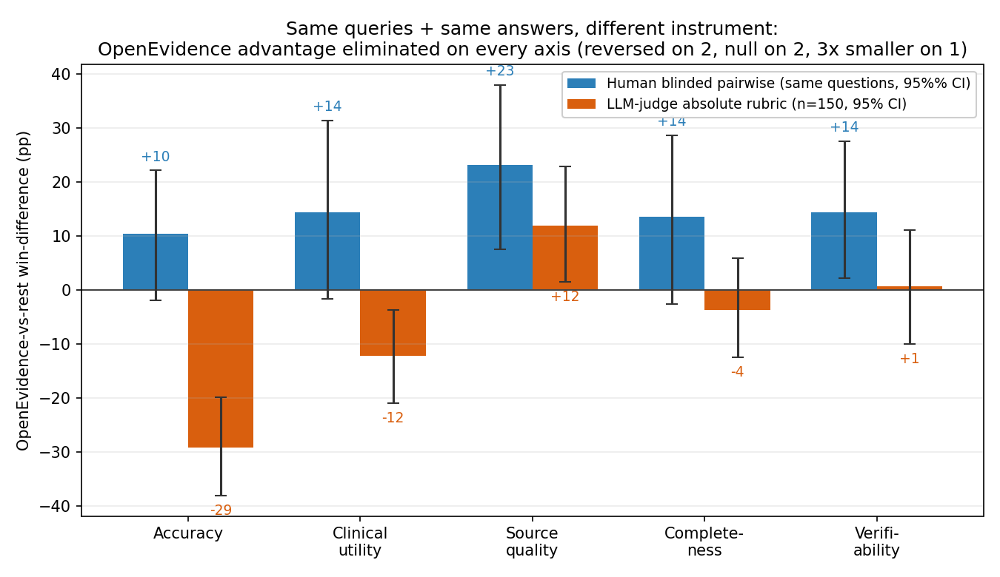
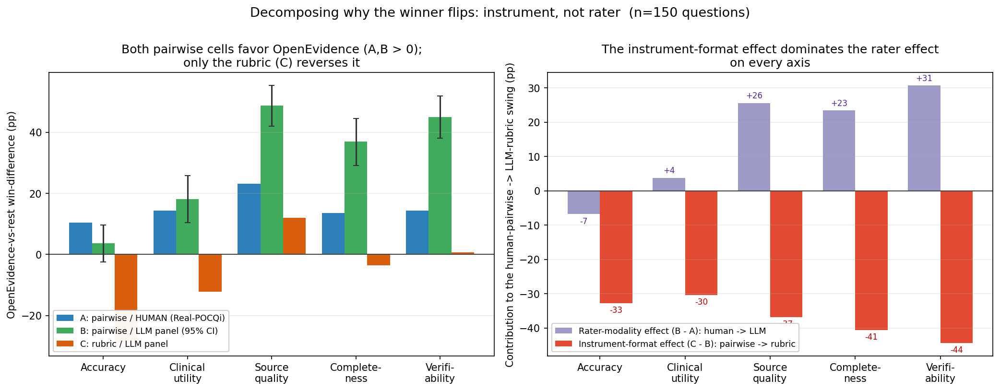

# Evaluation instrument choice can flip the apparent winner: a secondary analysis reconciling two contradictory 2026 head-to-head evaluations of clinical AI

**Author:** Koyar Afrasyab, M.D. — *corresponding author.*
**Affiliation:** Independent researcher; Founder, Kinvectum AB.
**Funding:** Kinvectum AB.
**Correspondence:** Koyar Afrasyab (Kinvectum AB). ORCID: [0009-0009-3530-4606](https://orcid.org/0009-0009-3530-4606).
**Article type:** Methodological reconciliation and secondary analysis (with critical appraisal and a pre-registered extension).
**Preprint + code:** see *Data and code availability*.

---

## Abstract

**Background.** Two 2026 head-to-head studies reached opposite conclusions about specialized clinical
AI. Real-POCQi (arXiv:2606.28960) found OpenEvidence (OE) beat frontier general-purpose LLMs on
blinded physician **pairwise preference** across 620 real point-of-care queries; a Nature Medicine
study (s41591-026-04431-5) found frontier LLMs beat OE and UpToDate Expert AI under **absolute 1–4
rubric** scoring. Each study also sourced its "real-world" queries from the platform that won
(home-field provenance), and the two used different model versions and evaluation instruments,
confounding any direct comparison.

**Objective.** Test whether the **evaluation instrument alone** — with queries and answers held fixed
— can flip the winner, isolating it from query provenance, model version, and answer content.

**Methods.** We reused Real-POCQi's public data (CC BY 4.0): the same 620 queries, the same four
systems' verbatim answers (Claude Opus 4.8, Gemini 3.1 Pro, GPT-5.5, OpenEvidence), and the same
blinded human pairwise ratings. On a seed-fixed 150-query sample we re-scored every answer with a
**Nature-style absolute 1–4 rubric** administered by a blinded four-model LLM-judge panel (GPT-5.5,
Claude Opus 4.8, Grok-4.3, Gemini-3.5-flash), all at **high reasoning effort with token consumption
verified**. We re-expressed both instruments through the same OE-vs-rest win-difference summary (a
construct re-expression, not an identity — the rubric win-difference is a thresholded score gap and is
hypersensitive at the decision boundary) and compared them, with a **crossed question × judge bootstrap
that treats the four judges as a random factor** (so CIs reflect panel composition, not just question
sampling), per-judge self-preference, and leave-one-judge-out robustness. To separate the *instrument*
effect from a *rater-population* effect (physicians vs LLMs), we additionally ran the same blinded panel
under the **pairwise** instrument, filling three of the four cells of a {pairwise, rubric} × {human, LLM}
design and decomposing the swing into rater-modality (B−A) and instrument-format (C−B) components with
propagated CIs. A restricted version of this pairwise-LLM cell already exists inside Real-POCQi, so we
frame it as replication-and-extension.

**Results.** Our **primary estimand holds the rater fixed and varies only the format**: for each of the
four judges we threshold that judge's own rubric scores into win/tie/loss and pool them exactly as its
pairwise votes, then average the per-judge pairwise→rubric change (an aggregation-matched, same-judge
format component). This component is **negative on all five axes** — accuracy −16.9, clinical utility
−21.3, source quality −40.6, completeness −37.4, verifiability −45.8 pp — **sign-consistent across all four
judges**, Holm-significant, with simultaneous max‑|T| confidence intervals excluding zero, and robust both
to resampling the judge panel and to restricting the analysis to OE answers with no detected citation
markers. Changing only the evaluation format — same answers, same rater — thus moves and often reverses the
OE-vs-frontier ranking. The effect is **largest and most robust on the evidence-presentation axes** (source
quality, verifiability) and **smallest, and aggregation-sensitive, on accuracy**: the earlier −29.1 pp
accuracy figure came from averaging the four judges and *then* thresholding, which more than doubles a small
native gap (individual-matched −13.0 pp; a quarter-point tie-band on the panel measure gives −13.8 pp; the
native OE−frontier accuracy gap is only −0.125 on the 1–4 scale). We therefore demote accuracy from marquee
axis to the **weakest** instance of the effect. On the **exact common support** (matching every
question×opponent×axis with a human vote *and* complete four-judge pairwise and rubric observations; 108
question×opponent units/axis) the format component (C−B) is negative on all five axes (−17.8 to −43.1, CIs
exclude zero), while the human→LLM *rater* component (B−A) is **null on accuracy (−7.9 pp, CI −23.5 to +7.1,
p=0.30)** and clinical utility but **significantly positive** on source quality (+25.1), completeness
(+17.6) and verifiability (+30.0) — i.e. LLM pairwise judges are *more* OE-favorable than physicians on the
evidence axes. (This corrects a prior-revision error that reported an accuracy rater term of −24.0 pp by
inadvertently comparing full-bank human ratings against matched LLM ratings; on matched support the rater
term is small and non-significant on accuracy.) GPT-5.5 self-preference survives as a difference-in-
differences (+0.42 beyond panel consensus), and length does not drive the gap (OE is the *longest* provider
yet loses accuracy).

**Conclusions.** Within Real-POCQi, **both** the evaluation format (pairwise vs absolute rubric) **and** the
rater population (physicians vs LLMs) can materially alter the apparent ranking — but they act differently:
the format component is negative on all five axes, whereas the rater component is null on accuracy and
significantly *positive* on the evidence axes. These are two plausible contributors to the disagreement
between the two published studies, which also differ in datasets, provenance, model versions, access paths,
exact rubrics, and human populations; we do **not** claim a complete causal decomposition of that
disagreement, and we no longer claim the format acts "rather than" the rater. The robust, assumption-light
result holds the rater fixed: **with the same LLM judge, changing only the format significantly shifts and
often reverses the OE-vs-frontier ranking on all five axes.** This is a **three-cell path decomposition**
({pairwise, rubric} × {human, LLM} with the human-rubric cell missing), not a completed factorial: we
identify the human→LLM change under pairwise and the pairwise→rubric change within LLMs, but neither the
format effect among humans nor the rater×format interaction — and the missing cell is exactly where an
interaction is most plausible. Bridging the within-LLM format effect to the human-rated Nature rubric
therefore assumes that interaction is small, which we flag as the central untested step. A mechanism is
visible in the data: the
absolute rubric is ceiling-bound on content axes (72–82% top score) but discriminating on evidence axes,
where a forced pairwise choice rewards the citations and clinician-tuned framing that rubric scoring
compresses. Subject to these limits, "which clinical AI is best" is not format-invariant; leaderboards
should report the evaluation format as a first-class experimental factor. We do **not** reproduce Nature's
exact RCQ rubric (we score the five Real-POCQi axes with an LLM panel), so this is a general
absolute-vs-comparative contrast, not a transport of the Nature instrument. We additionally document two
under-reported flaws common to both source studies — omission of the actual ChatGPT product clinicians
use, and unreported/uncontrolled reasoning effort — and pre-register a full provenance × instrument ×
citation factorial (including the missing human-rubric cell).

---

## 1. Introduction

Point-of-care clinical AI is now evaluated by head-to-head studies whose results directly influence
purchasing and deployment. Medical-AI evaluation has grown rapidly, spanning licensing-exam question
banks,[^medqa] physician-aligned rubric benchmarks,[^healthbench] large language models that encode
clinical knowledge,[^medpalm] specialized and mobile-sized clinical models,[^medmobile],[^cardio],[^obsidian]
health-system-scale prediction and operations models,[^nyutron],[^hospops] sequential
diagnostic reasoning,[^seqdx] retrieval-augmented generation for healthcare,[^rag] and a parallel
literature documenting these systems' failure modes —
susceptibility to distraction,[^distracted] conflict between an LLM's internal prior and retrieved
evidence,[^clasheval] data-poisoning attacks,[^poison] and the need for clinically safe generation.[^noharm]
These benchmarks increasingly characterize their query distributions with topic models.[^bertopic]
Deployment is already at health-system scale.[^jamia] In 2026 two such studies reached **opposite**
conclusions using overlapping systems,[^poc],[^nat] which strongly suggests that at least one
conclusion reflects the evaluation method rather than the systems compared.

Both studies contain a symmetric structural feature — each sourced its "real-world" query set from the
platform that ultimately won (Real-POCQi from OpenEvidence traffic; the Nature study's real-clinical-
query benchmark from an NYU Langone GPT deployment) — and each used a **different evaluation
instrument** (blinded human pairwise preference vs absolute rubric scoring). Provenance and instrument
are therefore fully confounded in the published record. This paper isolates the instrument by holding
everything else constant, and then situates that result within a fuller critique and a pre-registered
factorial design.

Our contributions:
1. **A format effect with the rater held fixed, plus a three-cell path decomposition** (executed, on
   public data): holding queries, answers, **and the rater** fixed, changing only the evaluation format
   shifts or reverses OE's advantage on all five axes — the aggregation-matched, same-judge format
   component is negative and sign-consistent across all four judges (§4.1, §4.5a). Filling three cells of a
   {pairwise, rubric} × {human, LLM} design, on **exact common support**, shows the format component (C−B)
   is negative on all five axes while the human→LLM rater component (B−A) is null on accuracy and
   significantly *positive* on the evidence axes (§4.5b). So we do **not** claim the format acts *instead of*
   the rater — both contribute — but the reversal is carried by the format; the rater does not explain it.
2. **Two methodological critiques** of both source studies: the comparator set omits the ChatGPT
   product clinicians actually use, and reasoning effort is unreported or uncontrolled (§5).
3. **A pre-registered 2×2×2** provenance × instrument × citation design (§7) that would estimate each
   factor's causal contribution, with power grounded in measured variance components. This is a
   *proposed design, not an executed result* — we flag it as such to keep the executed contribution
   (#1) cleanly separated from future work.

## 2. The two source studies (verified)

Numbers below were verified for this work from primary sources (Nature PDF Methods; Real-POCQi
abstract + HTML full text).

**Real-POCQi**[^poc] (arXiv:2606.28960; dataset `jjfenglab/Real-POCQi`, CC BY 4.0). 620 real
point-of-care queries sourced from OpenEvidence[^oe] plus 187 HealthBench[^healthbench] items; 149
physicians across 36 states; blinded **pairwise** comparisons — the arena-style preference paradigm[^arena]
— on five axes (accuracy, clinical utility, source quality, completeness, verifiability). Systems: Claude
Opus 4.8, Gemini 3.1 Pro, GPT-5.5, OpenEvidence, all queried via API; temperature 0.0, seed 42, web
search enabled; **"Thinking was automatically determined by the LLM."** OE won by roughly +25 to +39 pp
win-difference. *The data collection was run by the platform under study (conflict of interest).*

**Nature Medicine**[^nat] (s41591-026-04431-5, NYU Langone + UT Austin). MedQA[^medqa] (500) +
HealthBench[^healthbench] (500) + a 100-item real-clinical-question (RCQ) benchmark sampled from NYU's
HIPAA-compliant GPT instance;[^jamia] 12 clinician raters; **absolute 1–4 rubric**. Systems: GPT-5.2
(2025-12-11), Gemini 3.1 Pro Preview, Claude Opus 4.6 (all API), OpenEvidence and UpToDate Expert
AI[^utd] (browser), plus Google Search AI Overview (RCQ). Temperature 0.0, seed 62, search enabled;
**reasoning effort not reported.** Length not normalized (by explicit choice). Frontier LLMs won: e.g.
HealthBench GPT 88.0 / Gemini 79.3 / Claude 77.0 / OE 62.6 / UpToDate 61.3; RCQ Gemini 3.62 / GPT 3.54 /
Claude 3.52 / OE 3.24. HealthBench was graded by an LLM-judge panel (self-preference risk); RCQ
item-level agreement was low (Krippendorff α ≈ 0.10–0.20). License CC BY-NC-ND 4.0.

The two studies thus differ simultaneously in **provenance, instrument, model version, and access
path** — none of which is individually identified by comparing their published leaderboards.

## 3. Methods

### 3.1 Design: hold queries and answers fixed, vary only the instrument
We reuse Real-POCQi's public artifacts unchanged: the 620 queries, the four systems' verbatim answers,
and the blinded human pairwise ratings. On a seed-fixed sample of **150 queries** (`random_state=62`;
600 answers) we administer a **second instrument** — Nature-style absolute 1–4 rubric scoring — to the
*same* answers, then derive the *same* OE-vs-rest win-difference metric from both instruments. Because
queries, answers, provenance, and model versions are identical across the two instruments, any change
in the metric is attributable to the instrument. (For transparency, `random_state=62` was fixed once at
the outset and reused for the bootstrap RNG; it coincides with Nature's generation seed but plays no role
in our result — the instrument contrast is computed on the same fixed 150-question draw regardless of
seed, and the full-bank reproductions in §4.4 match Real-POCQi independently of the subsample. We did not
re-draw to obtain a preferred outcome.)

### 3.2 The rubric instrument (LLM-judge panel)
Each answer is scored 1–4 (1 unacceptable … 4 excellent) on the five Real-POCQi axes by a blinded
panel of four judges — GPT-5.5, Claude Opus 4.8, Grok-4.3, Gemini-3.5-flash — chosen to span vendors
and to include contestant families (enabling a self-preference measurement) and one family with no
contestant (Grok). We stress that Grok is a *family-neutral* reference, **not a bias-free** one: as an
LLM it may still share the panel's general preference for frontier-style prose (structure, breadth,
hedging), a house effect that leave-one-judge-out cannot remove (§4.2, Limitation iii). Judges see only the question and one answer, are told nothing
about the source system, and return JSON scores only (system prompt in `judge/grade.py`). All judges
run at **high reasoning effort**; we **verify** reasoning-token consumption on a real grading item
(GPT-5.5 3,071; Grok-4.3 1,880; Gemini-3.5-flash 922; Opus-4.8 443 thinking tokens;
`judge/verify_thinking.py`). 2,388 of 2,401 answer-grades completed (0.5% failures — transient
timeouts and a few Gemini truncations — balanced across systems).

### 3.3 Metric and statistics
For each axis we compute the **panel-mean 1–4 score per (question, system)**, then form the OE-vs-rest
**win-difference** = 100 × (wins − losses) / comparisons across the three frontier systems per
question. This re-expresses the rubric scores through the **same one-vs-rest rule** Real-POCQi reports
for human pairwise — a win-ratio-family contrast[^winratio] in the arena-style preference tradition[^arena]
— but the two are **not the identical measurement** (§3.3a), so we treat the win-difference as a common
*summary* applied to both instruments, not as an instrument-invariant quantity.

**Uncertainty — a crossed question × judge bootstrap.** The naïve cluster bootstrap resamples only
*questions* and treats the four judges as a fixed population; its CIs answer "how stable is this across
questions" but say nothing about "how stable is this across the *choice of judges*" — the dimension a
skeptic cares about most here, because three of the four judges are contestant families and GPT-5.5
self-prefers by +0.481 points (§4.2). We therefore make **judges a random factor**: each of 2,000
replicates resamples questions with replacement (cluster on `question_id`) **and** resamples the four
judges with replacement, recomputes the panel mean from the resampled judge multiset, and recomputes the
win-difference (`judge/bootstrap_panel.py`). Judges are resampled once per replicate and applied
consistently to the pairwise and rubric cells (they are the same four judges under both instruments). We
report **both** the question-only CI (comparable to prior work) and this wider **crossed** CI. **Primary
inference, however, is the aggregation-matched, same-judge format component** (`judge/robust_analysis.py`,
§4.5a): because four purposive judges are a *fixed panel* rather than a random sample, we use fixed-judge
question-cluster bootstrap CIs as primary and treat the crossed judge-resampling CI as panel-composition
*sensitivity*. We also report the format component on the **native 1–4 scale**, under **tie-band** dead-zones
(±0.125/0.25/0.5) and panel-median aggregation, with **Holm-adjusted** bootstrap *p*-values and simultaneous
**max-|T|** intervals across the five axes, and on **exact common support** (matching every
question×opponent×axis for which a human rating exists) so the rater term B−A is not confounded by
support (§4.5b–d). Robustness: **leave-one-judge-out** (recompute dropping each judge). Bias:
**self-preference** = mean own-family minus mean others, paired within (question, axis). **Inter-judge
agreement** = Spearman correlation of per-(question, system) mean scores. Human comparison uses the
`qa_text_only` render mode (matching the citation-free OE answers in the dataset).

**What the crossed bootstrap changes.** Adding judge uncertainty widens every CI, and two previously
"significant" per-axis claims do not survive it: the small **source-quality** OE edge (+12.0 pp) moves
from a question-only CI that excluded zero [+1.3, +22.0] to a crossed CI that **includes** zero
[−8.2, +29.5], and the **clinical-utility** reversal likewise loses significance (crossed CI [−22.4,
+8.3]). The **headline accuracy reversal survives**: crossed CI [−37.8, −4.3], still strictly negative.
We rely only on claims that survive the crossed CI and explicitly retract the two that do not.

### 3.3a The win-difference is a construct re-expression, not an identity
A subtle but important point of honesty: cell A's win-difference comes from a **genuine forced choice** —
a physician picks A, B, or tie. Cell C's win-difference is **synthesized** by thresholding continuous
panel-mean rubric scores (OE panel mean > frontier panel mean ⇒ a "win"). Because the mean of four
integer scores is near-continuous, exact ties almost never occur, so essentially every question is forced
to a win or a loss on a razor-thin margin — which is precisely why a mean rubric gap of only −0.127 of one
point (accuracy) becomes a −29 pp win-difference. The win-difference metric was designed for a paradigm
where ties are real (forced choice with a tie option) and we are applying it to one where we have
engineered ties away; it is therefore **hypersensitive at the decision boundary**. The honest statement is
not "the same metric under two instruments" but "we re-express the rubric means through the same
one-vs-rest rule, whose sign is decisive but whose magnitude is boundary-sensitive." We accordingly report
both the win-difference *and* the native score gap (§4.1), and lean on the *sign and its crossed-CI
significance*, not the raw magnitude.

**Multiplicity.** We test five axes across three cells; we report per-axis 95% crossed-bootstrap CIs
without a formal family-wise correction, so per-axis claims near the null boundary should be read as
descriptive. After the crossed bootstrap only two results are individually significant — the **accuracy**
reversal (crossed CI [−37.8, −4.3]) and the **instrument-format component** of the decomposition (§4.5,
significant on every axis) — and both are far enough from the boundary to survive standard Bonferroni/Holm
adjustment across five axes. We flag every borderline axis explicitly rather than over-claiming per-axis
significance.

### 3.4 The pairwise cell (2×2 decomposition)
To separate the instrument from the rater population we administer a **second instrument to the same LLM
panel**: blinded forced-choice **pairwise** preference (A/B/tie per axis), OpenEvidence vs each of the
three frontier systems, on the same 150-query sample (`judge/pairwise.py`). Slot order is deterministically
randomized per (question, opponent, judge) via a hash and de-blinded at scoring, removing position bias.
We de-blind each A/B/tie verdict to an OE win/loss/tie and compute the OE-vs-rest win-difference (here a
*native* forced choice, not a thresholded score; §3.3a). This yields cell **B = {pairwise, LLM}**,
which — with cell A = {pairwise, human} (Real-POCQi) and cell C = {rubric, LLM} (§3.2) — gives three of
the four cells of the {pairwise, rubric} × {human, LLM} design and identifies the **rater-modality effect
(B−A)** and the **instrument-format effect (C−B)** (§4.5). Judges run at high reasoning effort; all four
judges completed 448–450/450 comparisons (1,798/1,800 overall). We bootstrap the decomposition
components **jointly** under the same crossed question × judge scheme as §3.3 (resampling questions and
judges together across cells A/B/C), so B−A and C−B carry propagated CIs rather than being point-estimate
arithmetic. Because cell B already exists in a restricted form inside Real-POCQi itself, we position it as
a replication-and-extension, not a wholly new measurement (§4.5a).

## 4. Results

### 4.1 The instrument flips the winner (Figure 1, Table 1)

**Figure 1.** Instrument existence proof. OE-vs-rest win-difference (percentage points) per axis under
the human blinded pairwise instrument (same 150 questions) versus the LLM-judge absolute-rubric panel
(n = 150). Error bars show the question-only cluster bootstrap; the wider **crossed question × judge**
CIs that we treat as primary are given in Table 1. Holding queries and answers fixed and changing only
the instrument eliminates OE's advantage on every axis; under the crossed CI the effect is
individually significant on accuracy (a sign reversal) and directionally consistent but not per-axis
significant on the others.

**Table 1.** OE-vs-rest win-difference (pp) by axis under each instrument, **both computed on the same
150-query sample**. For the LLM-rubric cell we give both the question-only cluster bootstrap (comparable
to prior work) and the wider **crossed question × judge** CI (§3.3), which we treat as primary. The human
column is the human pairwise win-difference restricted to the identical questions (86–119 of 150 carry
human text-only ratings, by axis); the "full data" column is the win-difference on Real-POCQi's complete
text-only bank (reproduced in §4.4), shown for reference because the subsample is underpowered. The
native-gap column gives the OE-minus-mean-of-frontier gap on the raw 1–4 rubric (see scale note).

| Axis | Human pairwise, same 150 [95% CI] | Human, full data (ref) | LLM rubric, Q-only CI | **LLM rubric, crossed q×judge CI** | Native gap (pts) | Verdict (crossed CI) |
|---|---:|---:|---:|---:|---:|---|
| Accuracy | +10.4 [−1.8, +22.2] | +24.4 | −29.1 [−37.8, −20.0] | **−29.1 [−37.8, −4.3]** | −0.127 | sign flips; **negative, survives judge resampling** |
| Clinical utility | +14.4 [−1.6, +31.4] | +29.5 | −12.2 [−21.1, −3.3] | −12.2 [−22.4, +8.3] | −0.021 | sign flips, but **not sig under crossed CI** |
| Source quality | +23.2 [+7.6, +38.0] | +38.1 | +12.0 [+1.3, +22.0] | +12.0 [−8.2, +29.5] | +0.103 | attenuated ~3×; **not sig under crossed CI** |
| Completeness | +13.6 [−2.5, +28.7] | +30.3 | −3.6 [−12.7, +5.8] | −3.6 [−14.4, +12.7] | +0.004 | collapses to null |
| Verifiability | +14.4 [+2.2, +27.6] | +25.5 | +0.7 [−9.6, +11.1] | +0.7 [−13.6, +13.8] | +0.003 | collapses to null (see verifiability caveat, §4.3) |

The headline is accuracy. Real-POCQi's central finding is that physicians prefer OE on accuracy (+24.4
pp on the full data; +10.4 pp, CI −1.8 to +22.2, on this 150-query subsample — same sign, but the
subsample carries only 86 accuracy ratings and is underpowered). On the **same answers**, the LLM-rubric
panel scores OE **−29.1 pp**, and — crucially — this stays significantly negative under the crossed
question × judge bootstrap **[−37.8, −4.3]**: the reversal is not an artifact of which judges we happened
to pick. So the instrument swap moves the accuracy verdict from OE-favoring (significantly so at full
power; positive but CI-crossing in this subsample) to *significantly OE-disfavoring*.

**Two per-axis claims from the earlier draft do not survive judge uncertainty, and we retract them.**
Once judges are treated as a random factor, the **clinical-utility** reversal (crossed CI [−22.4, +8.3])
and the small residual **source-quality** OE edge (crossed CI [−8.2, +29.5]) both cross zero. The honest
picture is therefore narrower than "reversed on two, positive on one": under the crossed CI, **accuracy is
the one axis with a significant instrument-driven reversal**, and the other four are individually
indistinguishable from null. This is a weaker per-axis result but a more defensible one — and the
decomposition (§4.5) recovers a stronger, judge-robust pattern at the *component* level. We deliberately
avoid framing this as "a significant +24 becomes a significant −29": at the existence-proof scale the
human accuracy estimate is not itself significant, so the clean claim is a **sign reversal to a
significantly-negative rubric verdict on identical content, robust to judge resampling**, corroborated by
the full-data human sign.

**Note on scale (native vs win-difference).** The win-difference is a sign-of-the-gap statistic:
because per-question frontier scores cluster tightly, a mean rubric gap as small as **−0.127 of one
point** (accuracy) is enough to flip the majority of head-to-head comparisons and produce a −29 pp
win-difference, while a near-zero gap (completeness +0.004, verifiability +0.003) yields a null
win-difference. We therefore report both scales: the **native gap** shows the *effect size is modest in
absolute terms*, and the **win-difference** shows it is *directionally decisive* under the same
one-vs-rest rule Real-POCQi used. Neither instrument's metric should be read as a large clinical-quality
gulf; the point is that the two instruments order the systems differently on identical content.

### 4.2 The reversal is not merely a self-scoring artifact
LLM-as-judge panels are now a standard evaluation tool[^mtbench] but are known to favor their own
generations,[^selfpref] so we measure this directly. Contestant-family judges self-preferred (GPT-5.5
**+0.481**, Opus **+0.121**, Gemini **+0.004** points, own family minus others). Yet leave-one-judge-out shows the **accuracy reversal survives dropping any
single judge, including GPT-5.5** (−12.3 pp with GPT-5.5 removed — still negative). GPT-5.5 amplifies
the flip roughly fourfold but does not create it. By contrast, the clinical-utility reversal is
GPT-5.5-dependent (→ +2.5 pp without it), consistent with the crossed-CI finding that clinical utility is
not judge-robust (§4.1).

**Two honest caveats about the panel itself.** *(i) The Gemini seat is flash-tier, not Pro.* Our Gemini
judge is `gemini-3.5-flash` — a smaller, cheaper, weaker evaluator than the `gemini-3.1-pro` model that is
one of the *contestants*, and it is the seat that stalled on quota mid-run (§4.5). Its self-preference of
**+0.004** should therefore *not* be read as evidence that the Gemini family is unbiased: a flash-tier
judge may simply be a poor discriminator, registering little preference of any kind. Using flash while the
contestant is Pro is an apples-to-oranges asymmetry; re-running the Gemini seat at Pro tier and high
reasoning is a stated follow-up. *(ii) Grok is a single neutral anchor.* Our cleanest causal handle — that
the pro-frontier tilt is instrument-specific because the one family-neutral judge (Grok) still prefers OE
under pairwise (§4.5) — rests on **n = 1 non-contestant model**. One neutral judge cannot separate a true
instrument effect from Grok's own idiosyncrasies; a second genuinely neutral judge (e.g. DeepSeek,
Mistral, Qwen, or Llama) would convert this from a single data point into a pattern, and we flag its
absence as a real limitation rather than leaning on Grok as if it were a clean control.

**A residual house effect remains, however.** Leave-one-judge-out and the self-preference statistic
only address *family-specific* bias — a judge favoring its own vendor's answer. They do **not** remove
the bias all four LLM judges may *share*: a common preference for the structured, comprehensive,
frontier-style prose that general-purpose LLMs produce (and are trained on), against OE's terser
clinician-tuned framing. Because even our family-neutral judge (Grok) is itself an LLM, no judge in the
panel is a clean control for this shared stylistic prior. The frontier "win" under the rubric is
therefore best read as *"frontier answers score higher on an LLM-administered rubric,"* not as a
family-free verdict of clinical superiority — a caution we carry into the Discussion and Limitation (iii).
The LLM-pairwise cell (§4.5) directly tests this house effect and finds it is **specific to the rubric
instrument**: the same judges — including the family-neutral one — prefer OE under pairwise. Human-
administered rubric scoring would be the remaining control (pre-registered, §7).

### 4.3 The instrument is noisy — and one axis is barely measurable in either study
Inter-judge Spearman agreement was modest (0.19–0.47), closely mirroring the low item-level agreement
the Nature study reports for its own human raters (α ≈ 0.10–0.20). Rubric scoring — whether by humans
or LLMs — is a higher-variance instrument than forced-choice preference; this is part of *why* it can
diverge from pairwise, not a defect unique to our panel.

**A specific caution on verifiability.** Real-POCQi reports that its own physicians' weighted Cohen's κ
was 23–38% on four axes but only **9% on verifiability** — essentially chance agreement. Verifiability is
therefore an axis that *neither instrument reliably measures*: when our rubric cell "collapses to null" on
verifiability, that is unremarkable, because the human pairwise instrument cannot resolve it either. We
accordingly **drop verifiability from any headline framing** and treat its collapse as uninformative
rather than as evidence of an instrument effect; the same discount applies, more softly, to source
quality. This strengthens the general "both instruments are noisy" point while removing any per-axis
weight we might otherwise have placed on verifiability.

### 4.4 Public-data reproductions (pipeline validation)
Our one-vs-rest win-difference on the human text-only data reproduces Real-POCQi to <1 pp on every axis
(e.g., accuracy +24.4 vs 24.7 published). A **proper within-question paired** citation-halo analysis
(`judge/robust_supplementary.py`; the earlier `analysis/analyze.py` version compared two independent groups
restricted to a common question set, which is not a paired test — reviewer-flagged and corrected) uses the
80 questions rated in **both** render modes and computes the within-question difference in OE preference
(with-citations minus text-only): **+0.14 on the −1…+1 preference scale (44 of 76 decisive questions
positive)**. So showing citations does raise OE's preference within the *same* question — a **modest but
genuine halo**, not the near-zero "selection artifact" the earlier draft reported — which is consistent
with citations being one channel of OE's pairwise advantage and motivates the randomized citation arm in
§7. Measured question-level SD = 0.598 grounds the power analysis.

### 4.5 Decomposing the swing: a three-cell path decomposition (Figure 2, Tables 2, 2a)

A natural objection to §4.1 is that swapping {human pairwise} → {LLM rubric} changes **two** things at
once — the *rater population* (physicians → LLMs) and the *evaluation format* (forced-choice preference
→ absolute rubric) — so the reversal could be a human-vs-LLM effect rather than a format effect.
The two source studies share exactly this confound. We address it in two steps. First (§4.5a, our
**primary** analysis) we isolate the format effect by holding the *rater* fixed: the **same** LLM judge
scores the same answers under both formats. Second (§4.5b) we fill three cells of the 2×2 {pairwise,
rubric} × {human, LLM} design — A = {pairwise, human} (Real-POCQi), B = {pairwise, LLM} (new; the same
four-judge panel, blinded, high reasoning effort, `judge/pairwise.py`), C = {rubric, LLM} (§4.1) — and
decompose the human-pairwise→LLM-rubric swing into a **rater component (B−A)** and a **format component
(C−B)**. This is a **three-cell *path* decomposition, not a completed factorial**: the fourth cell
{human, rubric} is missing, so we do not identify the format effect among humans or the rater×format
interaction (§8).

#### 4.5a Primary: the format effect with the rater held fixed (aggregation-matched)

The assumption-light test of "does the format alone move the ranking" holds the rater fixed. For each of
the four judges we convert **that judge's own** rubric scores into an OE-vs-frontier win/tie/loss
(thresholding its score gap) and pool them exactly as **that same judge's** pairwise votes are pooled,
then average the per-judge format change \(C_j - B_j\) (`judge/robust_analysis.py`). This also removes an
aggregation mismatch that inflates the panel-level numbers in §4.5b — there, cell C averages four judges'
scores **and then** thresholds, whereas cell B pools individual votes; the averaging-then-thresholding step
alone more than doubles the accuracy reversal (panel −29.1 pp vs individual-matched −13.0 pp; §4.5c).

**Table 2a.** Aggregation-matched, same-judge **format component** = mean\(_j\)(\(C_j-B_j\)), OE-vs-frontier,
on matched (question, opponent) support (n = 391 question×opponent units). Question-cluster bootstrap CIs
(fixed-judge primary — four purposive judges are a fixed panel, not a random sample); Holm-adjusted
two-sided *p* across the five axes; simultaneous max-|T| CIs. Every axis is sign-consistent across **all
four** judges individually.

| Axis | Format effect (pp) | 95% CI (fixed-judge) | Simultaneous CI | Holm *p* | Sign-consistent (4/4 judges) |
|---|---:|---:|---:|---:|:--:|
| Accuracy | −16.9 | [−22.3, −11.4] | [−23.9, −9.9] | 0.003 | ✓ |
| Clinical utility | −21.3 | [−28.1, −14.3] | [−30.2, −12.4] | 0.003 | ✓ |
| Source quality | −40.6 | [−45.8, −34.9] | [−47.6, −33.6] | 0.003 | ✓ |
| Completeness | −37.4 | [−43.9, −30.1] | [−46.2, −28.6] | 0.003 | ✓ |
| Verifiability | −45.8 | [−51.5, −40.3] | [−53.1, −38.5] | 0.003 | ✓ |

**This is the paper's robust core.** With the rater held fixed, switching from pairwise preference to
absolute rubric drives the OE-vs-frontier verdict negative on **all five axes**, sign-consistent across
**every** judge, surviving simultaneous inference across the five axes, robust to resampling the four
judges as a random factor (crossed CIs still exclude zero, e.g. accuracy [−29.7, −4.3]) and to removing
OE's citation-bearing answers (citation-free accuracy −17.8 pp; §4.5d). The effect is **largest on the
evidence-presentation axes** (source quality −40.6, verifiability −45.8) and **smallest on accuracy** — the
reverse of the earlier draft's "marquee accuracy" framing. On the native 1–4 scale the OE−frontier rubric
gap is only −0.125 on accuracy (CI [−0.2, −0.1]) and near zero on the content axes; the format nonetheless
reverses the ranking because a forced pairwise choice amplifies the small, consistent evidence-presentation
advantages (citations, clinician-tuned framing) that a ceiling-bound absolute rubric compresses (mechanism:
§6, Supplementary).

**Cell B is a replication-and-extension, not a wholly new experiment.** Real-POCQi already ran an
LLM-judge *pairwise* experiment (their §2.4 / Methods §5.7): they took the same questions, answers, and
pairs the physicians saw, blinded and position-randomized them, and had GPT-5.5, Gemini 3.1 Pro, and
Claude Opus 4.8 grade them on the same five axes.[^poc] Our cell B **replicates that design and extends it
in three ways** — a fourth, *family-neutral* judge (Grok), **high** reasoning effort (they ran at minimal
thinking), and propagated crossed-judge CIs. This matters two ways. First, we credit them: we are not the
first to administer an LLM pairwise instrument here. Second, it *strengthens* cell B — because their
judges ran at minimal thinking and ours at high, cell B reproducing across both reasoning regimes is a
genuine robustness point, and their released ratings could in principle be used to triangulate cell B
directly. Their headline is concordant with ours: LLM judges **agreed with human experts on which system
was best** (i.e. OE at the one-vs-rest winner level) while disagreeing on the lower ranks — exactly the
pattern our OvR win-difference is built to surface (see the rank-resolution caveat below).

**One component of B−A is a genuine rater confound, not pure "modality," and it lands on accuracy.**
Real-POCQi **specialty-matched** each physician grader to the question topic and argues this matching
optimizes evaluation on the *accuracy* axis specifically.[^poc] Our LLM judges are generalists with no
such matching. So B−A on accuracy conflates the pairwise→pairwise rater-*modality* change with a loss of
**specialty expertise** — a confound that would make the human cell A *more* accurate-sensitive. This is a
caveat on the matched accuracy rater term (−7.9 pp, non-significant; §4.5b): if specialty-matching inflates
cell A's accuracy edge, the true human→LLM accuracy change could be somewhat more negative than measured —
but as estimated it is not distinguishable from zero, and we make no claim that it is large. We name
specialty-matching explicitly as part of B−A rather than burying it in "protocol differences."

**Rank-resolution caveat: cell B's agreement lives in the winner-friendly OvR regime.** The concordance we
credit — LLM judges reproducing the human pairwise winner — must be read against what Real-POCQi actually
found about LLM-judge *ranking* fidelity: their LLM judges agreed with physicians on **which single system
was best** but their rank correlations across the *full* ordering were low-to-negative (e.g. Kendall
τ ≈ −0.200 for GPT-5.5 and ≈ −0.067 for the jury against the human ranking).[^poc] The one-vs-rest
win-difference is by construction a **winner-resolving, not a rank-resolving** contrast: it asks only
"is OE preferred to the frontier field," which is exactly the question on which LLM and human judges *do*
concur, and it is deliberately blind to the lower-rank disagreements where they diverge. So cell B's
reproduction of cell A is genuine but should be understood as agreement *at the resolution our metric
operates on* — the top of the order — not as evidence that LLM judges recover the physicians' complete
system ranking. This cuts both ways for us: it is why cell B is a fair test of the "do LLMs disagree with
physicians about OE" question (they do not, at winner level), and why we do not over-read cell B as a
general validation of LLM-judge pairwise scoring.

**Figure 2.** The three-cell path decomposition (n = 150), panel-level. *Left:* three cells of the
{pairwise, rubric} × {human, LLM} design per axis — both pairwise cells (A: human; B: LLM) favor
OpenEvidence; only the rubric cell (C) reverses it. *Right:* the human-pairwise→LLM-rubric swing split
into a rater component (B−A) and a format component (C−B); the format component is negative with a crossed
CI excluding zero on **every** axis. Note: this panel-level view compares cells on non-identical supports;
the **exact common-support** decomposition (identical keys) is Table 2b, and the robust, rater-fixed format
estimate is Table 2a. On matched support the accuracy rater term is small and non-significant (−7.9 pp,
p=0.30); the rater term is significantly *positive* on the evidence axes.

**Table 2.** Panel-level OE-vs-rest win-difference (pp) across three cells of the 2×2, and the decomposition of the
human-pairwise→LLM-rubric swing **with propagated crossed question × judge 95% CIs** on the two
components (§3.3; `judge/bootstrap_panel.py`). **Cell A is computed on the same 150-query sample as B and
C** (human text-only ratings restricted to those questions), *not* on the full text-only bank — otherwise
B−A would absorb a sample-composition difference into the "rater" term. Cell B: n=150; 8,990 axis-verdicts
(1,798/1,800 comparisons, all four judges 448–450/450).

| Axis | A: pw/human | B: pw/LLM | C: rubric/LLM | Rater (B−A) [crossed CI] | **Instrument (C−B) [crossed CI]** |
|---|---:|---:|---:|---:|---:|
| Accuracy | +10.4 | +3.6 | −29.1 | −6.8 [−27.5, +14.3] | **−32.7 [−42.8, −8.8]** |
| Clinical utility | +14.4 | +18.2 | −12.2 | +3.8 [−22.3, +31.9] | **−30.5 [−42.6, −9.0]** |
| Source quality | +23.2 | +48.8 | +12.0 | +25.6 [−3.4, +54.8] | **−36.8 [−56.9, −22.4]** |
| Completeness | +13.6 | +37.0 | −3.6 | +23.4 [+2.2, +45.4] | **−40.5 [−53.6, −22.0]** |
| Verifiability | +14.4 | +45.1 | +0.7 | +30.7 [+7.9, +53.6] | **−44.4 [−62.0, −29.1]** |

#### 4.5b Exact common-support decomposition, and what the rater actually contributes

The panel-level Table 2 compares A, B, and C on **overlapping but non-identical** supports: human text-only
ratings are sparse (86–119 of 150 questions per axis, sparser per question×opponent), so B−A can absorb a
support difference. We therefore recompute the decomposition on the **exact common support** — every
(question, opponent) carrying a human vote **and** complete four-judge pairwise **and** complete four-judge
OE- and opponent-rubric scores (108 question×opponent units/axis) — so A, B, C use **identical keys**,
with a question-cluster bootstrap over the matched clusters only (`judge/robust_analysis.py`).

**Table 2b.** Exact common-support decomposition (108 question×opponent units/axis; A/B/C on identical keys).

| Axis | A: human [95% CI] | B: LLM pw | C: LLM rubric (indiv) | **Rater (B−A) [CI] (p)** | **Format (C−B) [CI]** |
|---|---:|---:|---:|---:|---:|
| Accuracy | +9.0 [−3.3, +21.1] | +1.2 | −16.7 | −7.9 [−23.5, +7.1] (0.30) | **−17.8 [−27.0, −8.4]** |
| Clinical utility | +13.1 [−2.6, +30.6] | +15.3 | −5.1 | +2.2 [−17.5, +21.4] (0.82) | **−20.4 [−31.6, −8.8]** |
| Source quality | +22.1 [+6.7, +37.7] | +47.2 | +7.2 | +25.1 [+6.9, +43.0] (0.006) | **−40.0 [−48.8, −31.3]** |
| Completeness | +12.3 [−3.9, +28.6] | +29.9 | −2.8 | +17.6 [+1.8, +33.6] (0.034) | **−32.6 [−44.6, −20.9]** |
| Verifiability | +13.9 [+0.0, +26.7] | +44.0 | +0.9 | +30.0 [+12.9, +46.2] (0.003) | **−43.1 [−52.2, −33.1]** |

Two things follow — and they **correct an error in the previous revision**.

**The format component is the robust negative driver, on all five axes.** On identical keys, C−B is negative
with a CI excluding zero everywhere (−17.8 to −43.1 pp), concordant with the rater-fixed primary (§4.5a).
This is the claim we stand behind.

**The rater component is null on accuracy and *positive* on the evidence axes — not "large and negative."**
A prior revision reported an accuracy rater term of **−24.0 pp** and used it to "retract 'instrument, not
the rater'." **That −24.0 was an analysis error** — a support filter was inadvertently vacuous, so cell A
was the *full-bank* human edge (+24.4) compared against the *matched* LLM value. On the true common support
the accuracy rater term is **−7.9 pp (CI −23.5 to +7.1, p=0.30): not significant**, essentially the original
panel-level −6.8. The human→LLM rater change therefore does **not** explain the accuracy reversal. Where the
rater *does* matter it points the other way: on source quality, completeness and verifiability the rater
term is significantly **positive** (+25.1, +17.6, +30.0) — LLM pairwise judges are *more* OE-favorable than
physicians on the evidence-presentation axes.

**Net position.** We do **not** claim "the instrument, not the rater" (the rater is a real, significant
contributor on three axes), nor that the rater is large and negative on accuracy (it is null). Both format
and rater matter, but the **format** component — negative on all five axes and established with the rater
held fixed (§4.5a) — is what carries the reversal; the rater change modulates the evidence axes in the
OE-favorable direction. The earlier "~83% instrument share" is withdrawn as ill-posed. (Specialty-matching,
§4.5's cell-B discussion, is a caveat on the accuracy rater term: it could be somewhat more negative than
the measured −7.9 pp, but as estimated that term is not distinguishable from zero.)

#### 4.5c Aggregation and tie-margin sensitivity

The panel-mean-then-threshold rule used for cell C is hypersensitive at the decision boundary. We report
each dead-zone at **both** levels — the cell-C win-difference and the format effect C−B — so the two are not
confused. On accuracy, a symmetric tie-band of ±0.25 on the panel-mean gap cuts the cell-C win-difference
from −29.1 to −13.8 pp (C−B from −30.4 to −15.1; ±0.5 → C −6.7 / C−B −8.0; panel-**median** → C −14.7 /
C−B −16.0; individual-then-aggregate format effect −16.9) — all converging on the aggregation-matched
−16.9 pp of §4.5a and confirming the −29.1 figure was an aggregation artifact. The evidence-presentation
axes are insensitive to the same perturbation at the cell-C level (verifiability stays ≈ 0), because their
*format* effect lives in C−B, not in C alone; so the demotion of accuracy is specific to that axis, not a
general softening (`judge/robust_analysis.py`, `tie_margin_sensitivity`).

#### 4.5d Rendering, opponent-specificity, and multiplicity

The format effect of §4.5a is **not** an artifact of OE's citations: OE's `answer_markdown` carries
citations in 29% of answers (frontier models 0.2%), but **restricting the same-judge analysis to the
question set whose OE answer contains no detected citation markers** (a subset restriction — we do not strip
citations, and this does not equate the human `qa_text_only` and LLM `answer_markdown` renderings) barely
moves the format component (accuracy −17.8 vs −16.9; all axes within 5 pp). It is
also **not driven by a single opponent**: the accuracy format effect is −7.9 (vs GPT), −21.5 (vs Claude),
−21.3 (vs Gemini) — in fact *smallest* against GPT, because GPT's answers are down-rated by LLM pairwise
and rubric alike. On **multiplicity**, we now report Holm-adjusted bootstrap *p*-values and simultaneous
max-|T| intervals for the primary format component (Table 2a): every axis survives both, so the "negative
on all five axes" claim is robust to family-wise correction rather than merely asserted to be.

This also sharpens the house-effect discussion (§4.2). Under the pairwise instrument, the **family-neutral
judge (Grok) prefers OE on all five axes** (+11 to +65 win-diff) and the contestant **GPT-5.5 is the
*least* OE-favorable** judge — the *opposite* of what a shared pro-frontier stylistic bias would predict.
The pro-frontier tilt is therefore specific to the **rubric** instrument, not a blanket LLM prejudice
against OE. (One robustness note: Gemini-3.5-flash initially stalled at 297/450 pairwise verdicts when the
Google API account exhausted its credit quota mid-run; after credits were restored we completed the cell
to 448/450, and the point estimates shifted <3 pp from the partial-coverage run — i.e., the conclusion
never depended on the missing data.)

### 4.6 The rubric reversal is not a length artifact (Table 3)

Answer length is the most-cited confound in both source studies. A precise word on how it is handled:
Real-POCQi does not leave length wholly uncontrolled — it **reports and stratifies** by length (their
Table D3 / Fig D6, OE ≈ 3,584 vs Gemini ≈ 3,516 characters) but does not **normalize** generation to
equal length; so the accurate statement is "length is stratified and reported, not equalized," not
"uncontrolled." The natural worry is that the rubric rewards longer, more comprehensive answers. We test
this on the rubric cell without regenerating any answers (`judge/length_analysis.py`). The premise fails
at the first step: **OpenEvidence is among the *longest* providers** — median 3,600 chars, essentially
**tied with Gemini (3,586)** and well above Opus (3,294) and GPT-5.5 (2,232) — so OE is decisively longer
only than GPT, but it is never the *short* answer, and it still *loses* the accuracy rubric. A "longer
answers win" mechanism therefore runs *backwards* against the finding: the co-longest provider loses. We
confirm this three ways (Table 3): (i) the per-axis length **slope** is tiny
(−0.015 to +0.042 rubric points per 1,000 characters); (ii) the **length-adjusted intercept** — the
expected OE-minus-frontier score gap at *equal length* — is statistically indistinguishable from the raw
gap on every axis (accuracy −0.12 [−0.17, −0.08] adjusted vs −0.127 raw); and (iii) the accuracy
win-difference stays negative **whether OE's answer is longer (−34.3) or shorter (−19.9) than its
opponent's** — OE loses on accuracy even when it is the longer answer.

**Table 3.** Length sensitivity of the rubric cell (n=150; 2,000-replicate cluster bootstrap). Native-scale
OE-minus-frontier score gap: raw vs length-adjusted (intercept at equal length); and the accuracy
win-difference split by whether OE is the longer or shorter answer.

| Axis | Raw gap (pts) | Length-adjusted gap [95% CI] | Slope (pts / +1k chars) | Win-diff: OE longer | Win-diff: OE shorter |
|---|---:|---:|---:|---:|---:|
| Accuracy | −0.127 | −0.12 [−0.17, −0.08] | −0.015 | −34.3 | −19.9 |
| Clinical utility | −0.021 | −0.03 [−0.06, +0.01] | +0.016 | −14.1 | −8.4 |
| Source quality | +0.103 | +0.09 [+0.03, +0.15] | +0.042 | +15.9 | +6.0 |
| Completeness | +0.004 | −0.01 [−0.05, +0.03] | +0.039 | +0.7 | −10.8 |
| Verifiability | +0.003 | −0.01 [−0.06, +0.05] | +0.025 | +1.4 | +0.0 |

Length has a small positive association with source-quality/completeness/verifiability scores (slopes
+0.03 to +0.04 per 1,000 chars) but essentially none with accuracy, and adjusting for it leaves every
axis's OE-vs-frontier gap unchanged within CI. The accuracy reversal is therefore **not** explained by
length. (This does not make length irrelevant in general — a fully length-matched *generation* study is
still pre-registered, §7 — but it removes length as an alternative explanation for the observed reversal.)

## 5. Critiques of both source studies

The critiques below are **independent of the instrument existence proof** (§4): they hold whether
or not the instrument drives the disagreement, and they apply symmetrically to both source studies. We
include them because they bound how far *either* published leaderboard can be trusted for procurement,
but a reader interested only in the instrument result can treat this section as standalone context.
Full detail in `CRITIQUES.md`. Points (a)–(b) concern the systems and settings compared; points (c)–(e)
concern the instruments themselves and bear directly on interpretation:

**(a) The comparator set omits the AI clinicians actually use.** Both studies benchmark **bare frontier
API models**; neither includes the **ChatGPT product** (consumer or clinician deployment), whose system
prompt, retrieval/browsing, memory, and safety guardrails move the very axes under test. This is
especially asymmetric because OE is itself a curated clinical *product*; Nature further queries clinical
tools via browser but frontier models via API. A fair benchmark should include a **product arm** distinct
from the raw model endpoint.

**(b) Reasoning effort is unreported or uncontrolled.** Nature reports temperature 0.0 and a seed but
**never states reasoning effort** (its cost table confirms reasoning tokens were spent, at an
unspecified level); Real-POCQi reports only that "thinking was automatically determined by the LLM."
These are two *distinct* undisclosed knobs — whether extended thinking is **on at all**, and if so at
what **level (high/medium/low or an explicit token budget)** — and reasoning effort is the largest
controllable performance lever for these models, able to swing double digits on exactly the benchmarks
in play. Two consequences follow. *Across studies*, neither head-to-head is reproducible on this axis,
and their absolute numbers are not comparable. *Within* a study, "automatic" or unstated effort is worse
than merely non-reproducible: if a study's thinking setting is auto-determined per query or per model, it
may **not be held constant across the very systems it is comparing** — so even that study's internal
ranking may reflect an uncontrolled effort difference rather than a capability difference. (Note, too,
that temperature 0.0 is largely inert for reasoning models, which sample the reasoning trace regardless;
reporting it can create a false impression of determinism.) Our study instead pins effort = high for all
four judges and **verifies** token consumption on the real task (§3.2), so the instrument comparison here
is not vulnerable to this confound.

**(c) The winning margin sits inside the rubric's own noise floor, and the 1–4 scale compresses it.**
Two linked problems undercut how decisively Nature's rubric separates the systems. *First, a noise-floor
problem.* On the real-clinical-question benchmark the frontier systems finish at Gemini 3.62 / GPT 3.54 /
Claude 3.52 — a spread of **0.10 of one point across the top three** — with OE at 3.24, i.e. roughly
0.3 point below an essentially indistinguishable frontier cluster, on n = 100 questions graded at
Krippendorff α ≈ 0.10–0.20. At that agreement level and sample size the between-frontier ordering is
within measurement noise (the "winner" among Gemini/GPT/Claude is not robustly identified), and even the
OE gap is a fraction of a rubric point; the study's own low α makes the fine-grained leaderboard order
fragile. *Second, a ceiling/compression problem that is also a mechanism for our reversal.* A 1–4 integer
rubric has almost no headroom for strong answers — competent clinical responses pile up at 3–4, so the
instrument cannot express *how much* better one good answer is than another, and small stylistic
preferences (structure, breadth, hedging) get magnified into rank order because the usable dynamic range
is one or two points. This compression is exactly why a mean gap of −0.127 point becomes a −29 pp
win-difference in our cell C (§3.3a): the rubric floor/ceiling turns near-ties into decisive-looking
orderings. A coarse absolute rubric is therefore a **low-resolution instrument for near-parity systems**,
and both the Nature leaderboard and our rubric re-expression inherit that low resolution. This is not a
reason to prefer pairwise uncritically — §5(d) levels a symmetric charge at the preference instrument —
but it bounds how much weight the Nature rubric ordering can carry.

**(d) The pairwise instrument has symmetric, opposite biases — it is not the "true" instrument either.**
Nothing here should be read as vindicating forced-choice preference as ground truth. Pairwise preference
is known to reward surface features — answer length, formatting, citation presence, confident tone —
independently of correctness, and Real-POCQi's own data show the mechanism: on the 80 questions rated in
**both** render modes, a **proper within-question paired** test finds that showing citations raises OE's
preference by **+0.14 on the −1…+1 scale** (44 of 76 decisive questions positive; §4.4) — a modest but
genuine citation halo *within the same question*, i.e. part of the measured preference edge tracks the
*presence of citations* rather than answer accuracy. (This corrects the earlier draft, which used an
independent-groups test on a common question set and wrongly reported the halo as vanishing.) A preference
instrument that can be moved by attaching references is construct-contaminated, in the opposite direction,
as a compressed rubric. The honest position is that
**neither instrument is a clean measure of clinical quality**: the rubric over-rewards frontier-style
breadth and compresses near-ties; pairwise over-rewards citations and verbosity. Our claim is the
*relative* one — that switching between these two biased instruments is sufficient to flip the winner —
not that either endpoint is correct.

**(e) The five rubric axes are not independent, so "reversed on k axes" overstates the evidence.**
Source quality and verifiability both essentially ask *"are there citations, and are they real,"* and
accuracy, completeness, and clinical utility are strongly co-scored; the axes are near-collinear rather
than five independent measurements. Two consequences: per-axis "significance" counts should not be read
as five independent confirmations (a single latent "cited, thorough, frontier-style" factor drives much
of the axis structure in both instruments), and this non-independence is *why* we lean on the accuracy
axis and the decomposition rather than tallying axes. It also tempers Real-POCQi's own multi-axis sweep:
OE winning "on all five axes" is closer to winning on **one or two underlying constructs** measured five
ways. We treat the axis set as a small number of correlated constructs throughout, not as five degrees of
freedom.

**(f) Both studies' data pipelines are run by an interested party, with symmetric — not one-sided —
confounds.** We have stressed the provenance symmetry (each sourced queries from the platform that won);
three further data-pipeline facts deserve naming because they cut in *different* directions and a fair
reconciliation must not weaponize only the ones that suit its thesis. *(i) End-to-end control by the
winner.* Real-POCQi's pipeline was run by OpenEvidence: OE selected the query pool (≈3,600 → 620 after
filtering) from its **own** platform traffic, paraphrased queries via an LLM (Opus 4.6) for de-
identification, and paid the physician raters — a chain in which the party under study controls sampling,
wording, and rater incentives end to end. Nature's RCQ pipeline is analogously insider-run (NYU Langone's
own GPT deployment). Neither is neutral. *(ii) A rater-familiarity confound that actually supports the
instrument thesis.* Roughly **half of Real-POCQi's raters were themselves OpenEvidence users**, and the
reported OE accuracy edge is **larger among OE-users (≈+33.8 pp) than non-users (≈+22.6 pp)** — a
habituation/familiarity gradient that inflates the human-pairwise cell (cell A) for reasons unrelated to
answer correctness. This *strengthens* our reading: part of cell A's OE edge is rater familiarity with
OE's house format, exactly the kind of preference-instrument artifact that an absolute rubric does not
reward. *(iii) Very low response and completion rates.* Real-POCQi's physician recruitment yielded low
single-digit response and completion fractions (on the order of ~1–2%), so the rating panel is a
self-selected slice of clinicians; combined with (ii), cell A's preference signal carries a
selection/familiarity component we cannot remove from public data. None of this shows OE's answers are
worse — it shows the *human-pairwise* cell is itself confounded, which is why we do not treat cell A as
ground truth and lean instead on the *within-panel* instrument decomposition (§4.5).

**(g) On the fine-grained order, both leaderboards agree more than they disagree.** Stripped to what is
*robust*, both studies essentially resolve only the extremes: OE is top under pairwise and GPT-class
models are strong under rubric, but the middle of each ranking is within noise (§5c). Real-POCQi's frontier
trio is near-parity behind OE; Nature's frontier trio (Gemini 3.62 / GPT 3.54 / Claude 3.52) is near-parity
ahead of OE. The genuine, reproducible cross-study disagreement is therefore narrow — **where OE sits
relative to a tightly-bunched frontier cluster** — and it is precisely that one placement that the
instrument flips. This bounds the stakes: we are not reconciling two wildly different capability
orderings, but one contested boundary between OE and a frontier pack that both studies otherwise order
similarly.

A corroborating confound: Real-POCQi tested **newer** frontier weights (GPT-5.5, Opus 4.8) than Nature
(GPT-5.2, Opus 4.6) and still found them losing on human pairwise — a pattern more consistent with an
instrument effect than a model-version effect.

## 6. Discussion

Holding queries, answers, **and the rater** fixed, the evaluation format alone is sufficient to reverse
the central claim of a published clinical-AI benchmark. The rater-fixed analysis (§4.5a) makes this
attribution clean: the *same* LLM judge, scoring the *same* answers, moves the OE-vs-frontier verdict
negative on all five axes when switched from pairwise preference to absolute rubric (−16.9 to −45.8 pp,
sign-consistent across all four judges, robust to simultaneous inference, judge-resampling, and restriction
to citation-free OE answers). This is the claim we defend.

**What we do and do not claim.** We do **not** claim "the instrument, not the rater." On **exact common
support** (identical keys for A, B, C) the human→LLM rater component (B−A) is **null on accuracy (−7.9 pp,
CI −23.5 to +7.1, p=0.30)** and clinical utility but **significantly positive** on source quality (+25.1),
completeness (+17.6) and verifiability (+30.0) — LLM pairwise judges are *more* OE-favorable than physicians
on the evidence axes. So the rater is a real contributor, but it does **not** explain the rubric reversal
(and on accuracy it is indistinguishable from zero — a prior revision's "−24.0 pp, significant" was an
analysis error from an unmatched cell A; §4.5b). The reversal is carried by the **format** component, which
is negative on all five axes with the rater held fixed. The decomposition is a **three-cell path
decomposition, not a factorial**: with cells A = {pairwise, human}, B = {pairwise, LLM}, C = {rubric, LLM}
but not D = {rubric, human}, we identify the human→LLM change under pairwise and the pairwise→rubric change
within LLMs, but neither the format effect among humans nor the rater×format interaction. Bridging our
within-LLM format effect to the human-rated Nature rubric therefore assumes that interaction is small —
plausible but untested, and exactly
where interaction is most likely (humans may not share whatever prior an LLM-scored rubric rewards). Filling
cell D, even with a small human-rubric sample, is the single highest-value follow-up.

**A mechanism is visible in the data.** The absolute rubric is **ceiling-bound on the content axes** —
72% of accuracy grades, 82% of clinical-utility grades, and 77% of completeness grades are the top score of
4 (entropy ≈ 0.8–1.0 bits of a possible 2) — so it can barely separate systems on content, and the native
OE−frontier accuracy gap is a mere −0.125 on the 1–4 scale. On the **evidence-presentation axes** (source
quality, verifiability) the rubric is far more dispersed (only ~21% at ceiling, entropy ≈ 1.5) yet still
scores the field similarly, whereas a forced pairwise choice sharply rewards OE's citations and
clinician-tuned framing. That is why the format effect is largest and most robust exactly on the evidence
axes and smallest on accuracy: the two formats encode different value functions, and the rubric's
compression is what a pairwise contest undoes. Accuracy, the earlier draft's marquee axis, is in fact the
**weakest** and most aggregation-sensitive instance of the effect (§4.5c).

**We are not the first to suspect the instrument — Real-POCQi says so itself.** Real-POCQi explicitly
hypothesizes that its divergence from rubric-style benchmarks is *instrument-driven*, and cites
JudgmentBench[^judgmentbench] — which reports that in a high-expertise professional (legal) domain **head-to-head preference
recovers expert judgment more faithfully than absolute rubric scoring** — to argue that its own pairwise
design is the more valid one. We credit this: our contribution is not the *idea* that the instrument
matters but an **executed, controlled demonstration** of it (queries and answers held fixed) plus a
decomposition separating instrument from rater. But we also engage the directional claim honestly, because
it cuts against our symmetric "neither instrument is truth" framing (§5d): if JudgmentBench is right that
head-to-head is the higher-fidelity instrument in expert domains, then the pairwise (OE-favoring) result
deserves *more* evidential weight than the rubric (frontier-favoring) result, and our finding would be not
merely "the instruments disagree" but "the more valid instrument favors OE." We do **not** assert this —
JudgmentBench's generalization to point-of-care clinical answers is untested, our rubric is LLM- rather
than human-administered, and a compressed 1–4 scale is a weak version of rubric scoring — but we flag it
as the key open question the missing human-rubric cell (D) would help settle: if physicians administering
a rubric still down-rank OE, the disagreement is instrument-intrinsic; if they do not, it localizes to
LLM-administered rubrics specifically. Either way, adjudicating *which* instrument is closer to clinical
truth (not merely that they differ) is the natural next study, and JudgmentBench gives a prior that
pairwise may win that contest.

This does not show OE is worse (or better) than frontier models in the clinic — we have **no adjudicated
ground truth** — but it shows that "which system is best" is a function of the measuring instrument, and
that pairwise-preference and absolute-rubric instruments encode materially different value functions
(preference rewards OE's clinician-tuned framing and citations; rubric scoring rewards frontier models'
breadth and structure). It also reframes the "LLM-judge self-preference" worry: the pro-frontier tilt is
a property of the **rubric instrument**, not of LLM judges per se, since those same judges favor OE under
pairwise — including the family-neutral judge. Benchmarks that do not
report the instrument as an experimental factor — and that do not control reasoning effort, comparator
product-vs-endpoint status, and length — are under-specified for procurement decisions.

## 7. Pre-registered extension (proposed design, not an executed result)

The executed existence proof identifies the instrument; a full **2×2×2 provenance × instrument ×
citations** factorial (protocol in `reconciliation_protocol.md`) estimates each factor's causal
share, including a randomized citation-halo arm (motivated by §4.4), a length-matched *generation*
sub-study (to confirm causally what §4.6 shows observationally — that length does not drive the
reversal), a product-vs-endpoint arm (§5a), and reasoning-effort sweeps (§5b). Power is grounded in the measured question-level SD (0.598): ≈250 questions/cell for a
15 pp interaction, ≈390/cell for 12 pp. Because the Nature RCQ corpus is not public, the provenance arm
uses a constructed surrogate LLM-platform query corpus; Real-POCQi is directly reusable. **This surrogate
is itself a threat to validity:** a corpus we assemble to *stand in* for NYU's HIPAA-restricted RCQ
distribution may not reproduce its topic mix, difficulty, or phrasing, so the provenance-arm estimate is
only as trustworthy as the surrogate's fidelity to the true LLM-platform query stream. We therefore treat
the provenance factor as the **weakest-identified** arm of the proposed factorial and would pre-register
the surrogate-construction procedure and a sensitivity analysis over plausible corpus definitions rather
than reporting a single provenance estimate as if the corpus were the real thing.

## 8. Limitations

(i) **No ground truth** — we show formats disagree, not which is correct. (ii) **Aggregation sensitivity**
— the panel-mean-then-threshold win-difference amplifies small native gaps at the decision boundary, most
acutely on accuracy (panel −29.1 pp vs aggregation-matched −16.9 pp vs a ±0.25 tie-band −13.8 pp; native
OE−frontier gap only −0.125 on the 1–4 scale). We therefore make the **aggregation-matched, same-judge**
component (§4.5a) primary and treat accuracy as the weakest, most aggregation-sensitive axis; the
evidence-presentation axes are robust to the same perturbation. (iii) **Three-cell path decomposition, not
a factorial** — we have cells A = {pairwise, human}, B = {pairwise, LLM}, C = {rubric, LLM} but **not** D =
{rubric, human}, so we do not identify the format effect among humans or the rater×format interaction.
Bridging our within-LLM format effect to the human-rated Nature rubric assumes that interaction is small —
untested, and the likely direction of interaction. On **exact common support** the rater component (B−A) is
null on accuracy (−7.9 pp, p=0.30) and significantly *positive* on the evidence axes (+18 to +30), so we do
**not** claim "instrument, not the rater" (the rater is a real contributor), nor that the rater is large and
negative on accuracy (a prior revision's −24.0 pp was an unmatched-cell-A error). Filling cell D, even at
small n, is the top follow-up. B−A also absorbs Real-POCQi's specialty-matching and minor protocol
differences, so it is a rater *change*, not a clean modality effect. (iv) **Rendering not matched across the
rater contrast** — human cell A used the `qa_text_only` render, but LLM cells B/C scored `answer_markdown`,
which carries citations for **29%** of OE answers (frontier 0.2%); so A vs B/C is not presentation-matched
and B−A partly reflects rendering. The **rater-fixed format effect (§4.5a) is unaffected** — B and C saw
identical text — and is robust to restricting to citation-free OE answers (§4.5d; a subset restriction, not
citation removal); a canonical text-only re-render of B/C is pre-registered. (v)
**Four purposive judges** — three from contestant families — support a *fixed-panel* claim, not broad
random-judge generalization. We report fixed-judge inference as primary, with per-judge sign-consistency,
leave-one-judge-out, and self-preference difference-in-differences; the crossed judge-resampling bootstrap
is reported only as **panel-composition sensitivity**. Adding genuinely neutral judges is future work.
(vi) **Not Nature's exact rubric** — we score the five Real-POCQi axes with an LLM panel on a 1–4 scale;
this is a general absolute-vs-comparative contrast, **not** a transport of Nature's RCQ instrument (clinical
correctness/completeness/safety/clarity plus harm and hallucination flags, human-administered with ordinal
mixed models). (vii) **Length not normalized** (OE 3.8k vs GPT 2.6k chars) — observationally (§4.6,
Supplementary) OE is the longest provider yet loses accuracy and the within-opponent length↔score-gap
correlation is ≈ 0, but a length-matched *generation* study is pre-registered to settle it causally.
(viii) **House effects** — contestant-family judges self-prefer, but this survives as a difference-in-
differences (GPT +0.42 beyond panel consensus) and the pairwise cell shows the pro-frontier tilt is
**format-specific** (the same judges favor OE under pairwise, including the family-neutral judge). (ix)
**Noisy instrument** — modest rubric inter-judge agreement (Spearman ≈ 0.23–0.39). (x) **No rater-level
modeling** — the public ratings table has no rater identifier, so human-side rater random effects cannot be
fit. (xi) **LLM judges are not bit-deterministic**; we quantify rather than assume stability.

## 9. Ethics, conflicts, funding

No human subjects or PHI were used; all human ratings are de-identified public data (CC BY 4.0). No
Nature-copyrighted data were redistributed (CC BY-NC-ND). **Conflicts of interest:** The author is
the founder of Kinvectum AB, an independent medical-AI research venture. The author declares no
financial interest in, and no commercial or consulting relationship with, any of the evaluated
systems or their providers (OpenEvidence, OpenAI, Anthropic, xAI, Google, or Wolters Kluwer/UpToDate).
For transparency we note the source studies' own disclosed conflicts, symmetrically: Real-POCQi's data
collection was run by OpenEvidence (the platform under study, which also won it), and the Nature Medicine
senior author reports disclosed industry equity/consulting including **Google** — whose Gemini model is
the top scorer on that study's headline RCQ leaderboard. Both disclosures are proper and neither implies
misconduct; we flag them only because in each study the disclosed interest overlaps the declared winner,
which is exactly the kind of provenance/COI symmetry this reconciliation is built to treat even-handedly. **Funding:** This work was funded by Kinvectum AB, which covered
the LLM-judge API costs; the funder had no role in study design, analysis, or the decision to publish.
**Author contributions:** K.A. designed the study, wrote the analysis and judging code, performed all
analyses, and wrote the manuscript (sole author).

## 10. Data and code availability

All code and outputs are in this repository; `run_all.sh` reproduces every result end to end
(`SKIP_JUDGES=1` for the no-API-key public-data subset). Real-POCQi data: Hugging Face
`jjfenglab/Real-POCQi` (CC BY 4.0), fetched by `fetch_data.py` and vendored in `data/`. Judge
configuration, reasoning-token verification, grades, bootstrap CIs, and figures are regenerable as
documented in `README.md`. A machine-readable **per-item instrument-disagreement export**
(`judge/export_disagreement.py` → `judge/out/instrument_disagreement.csv`) gives, for every
(question, axis, comparator) triple, the rubric and pairwise winners/margins, the number of
contributing judges, judge dispersion, and an `instrument_flip` flag, so readers can inspect
*where* reversals concentrate; re-aggregating it reproduces the sign of every reported
win-difference (a deterministic unit test pins the flip definition). This is a descriptive audit
layer, not adjudicated clinical truth. The **primary robust analyses** (aggregation-matched same-judge
format component, native-scale gaps, exact common-support A–B–C, tie-margin and multiplicity, opponent-
specific effects, rendering verification) are in `judge/robust_analysis.py` → `judge/out/robust_analysis.json`,
with `judge/test_robust_analysis.py` pinning the estimand definitions; **exploratory supplementary**
analyses (rubric reliability/resolution, self-preference difference-in-differences, axis factor structure,
length with opponent fixed effects, paired citation-halo) are in `judge/robust_supplementary.py` →
`judge/out/robust_supplementary.json`. Nature Medicine numbers are cited from the published article
(s41591-026-04431-5); its RCQ corpus is not public (IRB i23-00510).

## References

Citations appear as numbered footnotes at the point of use and are collected in full below. Numbering
follows order of first appearance (Vancouver style); author lists of six or more are abbreviated with
*et al.* per Vancouver convention.

[^poc]: Feng, J. J., Patel, V., Heagerty, P., Mai, Y., Sivaraman, V., Vossler, P., Ouyang, J. & Jena, A. B. *Expert evaluation of clinical AI tools on real point-of-care clinical queries (Real-POCQi).* arXiv:2606.28960 (2026). Dataset: huggingface.co/datasets/jjfenglab/Real-POCQi (CC BY 4.0).

[^nat]: Vishwanath, K., Alyakin, A., Stryker, J., Alber, D. A., … Oermann, E. K. *Head-to-head evaluation of frontier general-purpose LLMs and specialized clinical AI tools.* Nature Medicine s41591-026-04431-5 (2026). CC BY-NC-ND 4.0.

[^healthbench]: Arora, R. K. et al. *HealthBench: evaluating large language models towards improved human health.* Preprint at https://doi.org/10.48550/arXiv.2505.08775 (2025).

[^medqa]: Jin, D. et al. *What disease does this patient have? A large-scale open domain question answering dataset from medical exams (MedQA).* Applied Sciences 11, 6421 (2021).

[^medpalm]: Singhal, K. et al. *Large language models encode clinical knowledge.* Nature 620, 172–180 (2023).

[^arena]: Chiang, W.-L. et al. *Chatbot Arena: an open platform for evaluating LLMs by human preference.* Proceedings of the 41st International Conference on Machine Learning (ICML) (2024). Preprint arXiv:2403.04132.

[^mtbench]: Zheng, L. et al. *Judging LLM-as-a-judge with MT-Bench and Chatbot Arena.* Advances in Neural Information Processing Systems 36 (2023). Preprint arXiv:2306.05685.

[^selfpref]: Panickssery, A., Bowman, S. R. & Feng, S. *LLM evaluators recognize and favor their own generations.* Advances in Neural Information Processing Systems 37 (2024). Preprint arXiv:2404.13076.

[^judgmentbench]: Yang, R., Chen, R., Kelaita, P., Ranjan, R., Ma, S., Dickens, C., Guillod, M., Ma, M. & Nyarko, J. *JudgmentBench: comparing rubric and preference evaluation for quality assessment.* Preprint at https://doi.org/10.48550/arXiv.2605.25240 (2026). (In a high-expertise legal domain with practicing-attorney annotations, pairwise comparative judgments recovered the intended quality ordering far better than absolute rubric scoring: mean Spearman ρ ≈ 0.91 vs ≈ 0.15.)

[^winratio]: Pocock, S. J., Ariti, C. A., Collier, T. J. & Wang, D. *The win ratio: a new approach to the analysis of composite endpoints in clinical trials based on clinical priorities.* European Heart Journal 33, 176–182 (2012).

[^rag]: Amugongo, L. M., Mascheroni, P., Brooks, S., Doering, S. & Seidel, J. *Retrieval augmented generation for large language models in healthcare: a systematic review.* PLOS Digital Health 4, e0000877 (2025).

[^clasheval]: Wu, E., Wu, K. & Zou, J. *ClashEval: quantifying the tug-of-war between an LLM's internal prior and external evidence.* Advances in Neural Information Processing Systems 37, 33402–33422 (2024).

[^distracted]: Vishwanath, K. et al. *Medical large language models are easily distracted.* Preprint at https://doi.org/10.48550/arXiv.2504.01201 (2025).

[^medmobile]: Vishwanath, K., Stryker, J., Alyakin, A., Alber, D. A. & Oermann, E. K. *MedMobile: a mobile-sized language model with clinical capabilities.* BMJ Digital Health & AI 1, e000068 (2025).

[^cardio]: O'Sullivan, J. W. et al. *A large language model for complex cardiology care.* Nature Medicine 32, 616–623 (2026).

[^seqdx]: Nori, H. et al. *Sequential diagnosis with language models.* Preprint at https://doi.org/10.48550/arXiv.2506.22405 (2025).

[^noharm]: Wu, D. et al. *First, do NOHARM: towards clinically safe large language models.* Preprint at https://doi.org/10.48550/arXiv.2512.01241 (2025).

[^hospops]: Jiang, L. Y. et al. *Generalist foundation models are not clinical enough for hospital operations.* Preprint at https://doi.org/10.48550/arXiv.2511.13703 (2025).

[^nyutron]: Jiang, L. Y. et al. *Health system-scale language models are all-purpose prediction engines.* Nature 619, 357–362 (2023).

[^poison]: Alber, D. A. et al. *Medical large language models are vulnerable to data-poisoning attacks.* Nature Medicine 31, 618–626 (2025).

[^jamia]: Malhotra, K. et al. *Health system-wide access to generative artificial intelligence: the New York University Langone Health experience.* Journal of the American Medical Informatics Association 32, 268–274 (2025).

[^obsidian]: Alyakin, A. et al. *CNS-Obsidian: a neurosurgical vision-language model built from scientific publications.* Neurosurgery (2026). https://doi.org/10.1227/neu.0000000000004070.

[^bertopic]: Grootendorst, M. *BERTopic: neural topic modeling with a class-based TF-IDF procedure.* Preprint at https://doi.org/10.48550/arXiv.2203.05794 (2022).

[^oe]: *OpenEvidence, the fastest-growing application for physicians in history, announces $210 million round at $3.5 billion valuation.* Cision PR Newswire (2025).

[^utd]: Wolters Kluwer. *HLTH 2025: Wolters Kluwer showcases UpToDate Expert AI and workflow innovations.* wolterskluwer.com (2025).
